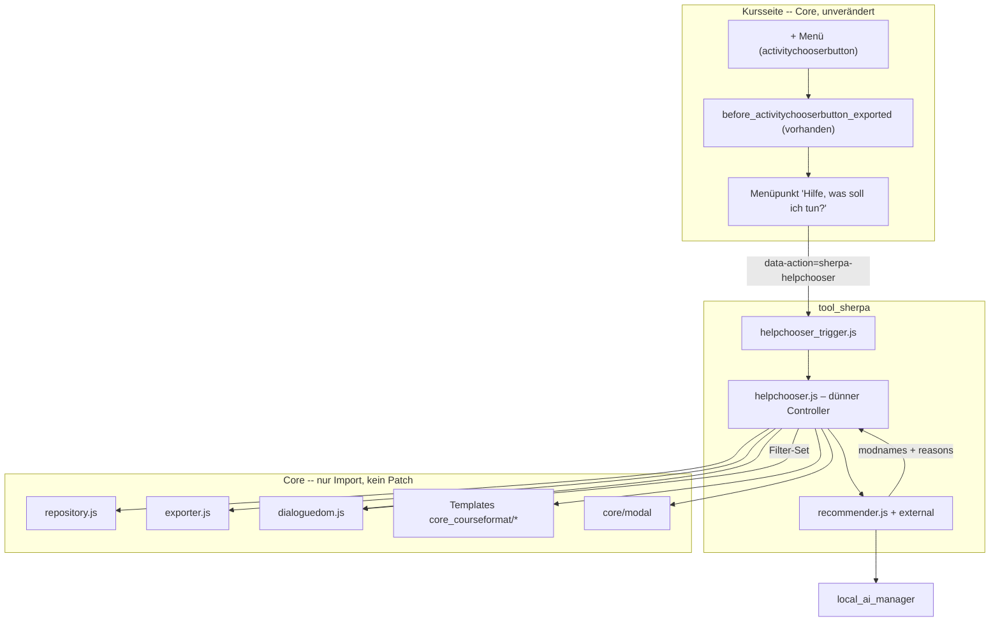
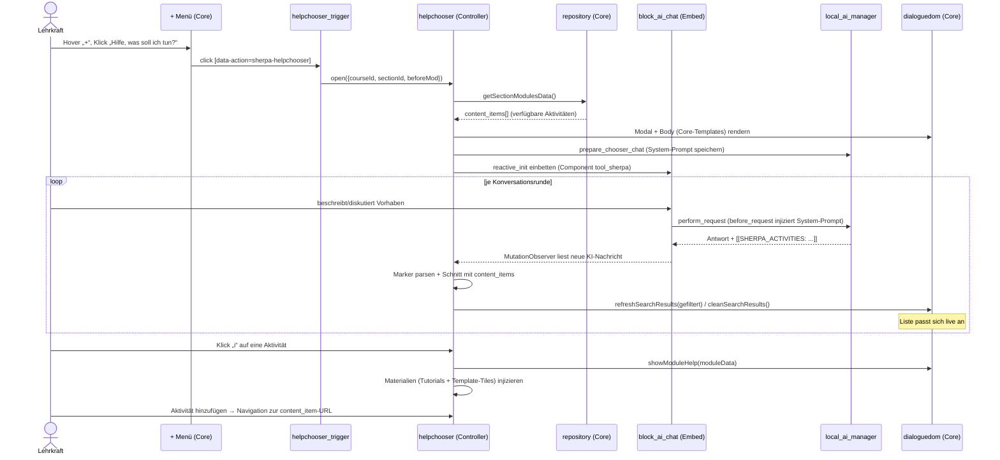

# Konzept: tool_sherpa „Hilfe, was soll ich tun?“ – eigener KI-Aktivitäts-Chooser (ohne Core-Patch)

| Feld           | Wert                                                                                     |
|----------------|------------------------------------------------------------------------------------------|
| Plugin         | `tool_sherpa`                                                                             |
| Status         | Entwurf – Ansatz „eigener Chooser“ (ersetzt den früheren Hook-Contribution-Ansatz)        |
| Autor          | Dr. Peter Mayer                                                                           |
| Copyright      | 2026 ISB Bayern                                                                           |
| Leitprinzip    | **Kein Core-Eingriff.** Wiederverwendung der Core-Templates/-AMD-Module per **Import**; nur ein dünner, eigener Controller. **Minimal-invasiver Wartungsaufwand.** |
| Einstiegs-Hook | `\core_course\hook\before_activitychooserbutton_exported` (Core, **bereits vorhanden**)   |
| Abhängigkeiten | `local_ai_manager` (für KI-Empfehlung); optional `block_ai_chat` reaktiv (Alternative B)  |

---

## Inhaltsverzeichnis

1. [Ziel & Use Case](#1-ziel--use-case)
2. [Leitentscheidung & Prinzipien](#2-leitentscheidung--prinzipien)
3. [Architekturüberblick](#3-architekturüberblick)
4. [Einstiegspunkt: Option im „+“-Menü (ohne Core-Patch)](#4-einstiegspunkt-option-im--menü-ohne-core-patch)
5. [Der tool_sherpa-Chooser](#5-der-tool_sherpa-chooser)
6. [Semantische Suche: KI → Namens-Set → Filter](#6-semantische-suche-ki--namens-set--filter)
7. [Begründung, Einsatzbeispiele & Materialien](#7-begründung-einsatzbeispiele--materialien)
8. [KI-Anbindung](#8-ki-anbindung)
9. [Wartungsminimierung & Risiko](#9-wartungsminimierung--risiko)
10. [Footprint: neue tool_sherpa-Dateien](#10-footprint-neue-tool_sherpa-dateien)
11. [Sicherheit (OWASP)](#11-sicherheit-owasp)
12. [Teststrategie](#12-teststrategie)
13. [Alternativen & Verworfenes](#13-alternativen--verworfenes)
14. [Offene Punkte & Entscheidungsbedarf](#14-offene-punkte--entscheidungsbedarf)

---

## 1. Ziel & Use Case

Eine Lehrkraft öffnet auf der Kurshauptseite (im Bearbeitungsmodus) am **„+“-Menü**
(neben „Neuer Abschnitt“ / „Aktivität oder Material anlegen“) einen zusätzlichen Eintrag
**„Hilfe, was soll ich tun?“**.

Nach dem Klick erscheint ein **tool_sherpa-eigener Activity Chooser**, der **weitgehend
identisch** zum Core-Chooser aussieht (dieselben Templates), aber:

1. Die Lehrkraft beschreibt in einem **KI-Chat semantisch ihr Vorhaben**
   (z. B. „Ich möchte, dass die Lernenden in Kleingruppen ein Thema erarbeiten und sich
   gegenseitig Feedback geben“).
2. Die **KI liefert einen begründeten Vorschlag**, welche Aktivitäten **weshalb** sinnvoll
   sind (z. B. *Wiki* für die kollaborative Erarbeitung, *Gegenseitige Beurteilung* für das
   Peer-Feedback).
3. Zu jeder vorgeschlagenen Aktivität erhält die Lehrkraft eine **dreiteilige Rückmeldung**
   (Abschnitt 7):
   - **Begründung** – warum diese Aktivität zum beschriebenen Vorhaben passt.
   - **Einsatzbeispiele** – konkrete Beispiele, *wie* die Aktivität didaktisch eingesetzt
     werden kann.
   - **Materialien** – Verweise auf **Tutorials** sowie **Beispiel-Templates** der Aktivität.
     Da es für das Demo noch keine echten Templates gibt, werden diese **gemockt** (z. B. als
     „Kurskachel“/Card-Tile mit „Demo“-Badge).
4. Die vorgeschlagenen Aktivitäten werden **genau so gefiltert/dargestellt wie heute bei der
   Suche nach dem Aktivitätsnamen** – nur dass nicht ein Suchbegriff, sondern die KI-Auswahl
   die Filterung bestimmt.

**Kernunterschied zum vorherigen Konzept:** Such- und Hilfe-Manipulation laufen **nicht über
neue Core-Hooks**, sondern über eine **tool_sherpa-eigene Implementierung**, die die
Core-Bausteine wiederverwendet. (Der frühere Hook-Contribution-Ansatz ist als Alternative in
Abschnitt 13 dokumentiert.)

---

## 2. Leitentscheidung & Prinzipien

| Prinzip | Umsetzung |
|---------|-----------|
| **Kein Core-Patch** | Es wird **keine** Core-Datei verändert. Einstieg über den **bereits existierenden** Hook `before_activitychooserbutton_exported`. |
| **Wiederverwenden statt kopieren** | Core-Templates und die AMD-Module `repository`, `exporter`, `dialoguedom`, `selectors` werden **importiert**, nicht dupliziert. |
| **Dünner eigener Controller** | tool_sherpa implementiert nur die Orchestrierung, die der Core nicht exportiert (siehe 5.2) – so klein wie möglich. |
| **Minimal-invasive Wartung** | Bewusst schlanker Funktionsumfang (Browsen, KI-Filtern, Info, Hinzufügen); Kopplung an Core-Interna dokumentiert und durch einen Smoke-Test abgesichert (Abschnitt 9). |
| **KI-agnostischer Datenfluss** | Die KI liefert nur **Aktivitätsnamen + Begründung + Einsatzbeispiele**; Tutorials/Template-Tiles stammen aus einem tool_sherpa-Provider (Demo: gemockt). tool_sherpa schneidet die Namen gegen die real verfügbaren Aktivitäten (Sicherheit, Abschnitt 11). |

---

## 3. Architekturüberblick



---

## 4. Einstiegspunkt: Option im „+“-Menü (ohne Core-Patch)

Der Core dispatcht beim Export des Chooser-Buttons den Hook
`\core_course\hook\before_activitychooserbutton_exported`
(in `core_courseformat\output\local\content\activitychooserbutton::export_for_template()`).
Plugins können darüber **Aktionslinks in das Dropdown** des „+“-Buttons einhängen.

> **Belegtes Vorbild im Core:** `mod_subsection` nutzt exakt diesen Hook, um den Menüpunkt
> „Subsection“ hinzuzufügen
> (`mod/subsection/classes/local/callbacks/before_activitychooserbutton_exported_handler.php`).
> tool_sherpa geht identisch vor – nur mit einer **eigenen `data-action`**, damit der
> Core-Chooser den Klick **nicht** abfängt.

`public/admin/tool/sherpa/db/hooks.php`:

```php
defined('MOODLE_INTERNAL') || die();

$callbacks = [
    [
        'hook' => \core_course\hook\before_activitychooserbutton_exported::class,
        'callback' => \tool_sherpa\local\callbacks\before_activitychooserbutton_exported_handler::class . '::callback',
    ],
];
```

`public/admin/tool/sherpa/classes/local/callbacks/before_activitychooserbutton_exported_handler.php`:

```php
namespace tool_sherpa\local\callbacks;

use core_course\hook\before_activitychooserbutton_exported;
use core\context\course as context_course;

/**
 * Adds the "Help, what should I do?" entry to the activity chooser button dropdown.
 *
 * @package    tool_sherpa
 * @copyright  2026 ISB Bayern
 * @author     Dr. Peter Mayer
 * @license    http://www.gnu.org/copyleft/gpl.html GNU GPL v3 or later
 */
class before_activitychooserbutton_exported_handler {

    /**
     * Add the Sherpa help-chooser action link.
     *
     * @param before_activitychooserbutton_exported $hook The hook.
     */
    public static function callback(before_activitychooserbutton_exported $hook): void {
        $section = $hook->get_section();
        $context = context_course::instance($section->course);

        if (!get_config('tool_sherpa', 'enablehelpchooser')
                || !has_capability('moodle/course:manageactivities', $context)
                || !has_capability('tool/sherpa:usesupport', $context)) {
            return;
        }

        $attributes = [
            'class' => 'dropdown-item',
            'data-action' => 'sherpa-helpchooser',      // Eigene Aktion – NICHT 'newModule'.
            'data-courseid' => $section->course,
            'data-sectionid' => $section->id,
            'data-sectionnum' => $section->sectionnum,
        ];
        if ($hook->get_cm()) {
            $attributes['data-beforemod'] = $hook->get_cm()->id;
        }

        $hook->get_activitychooserbutton()->add_action_link(new \action_link(
            new \moodle_url('#'),
            get_string('helpchooser_open', 'tool_sherpa'),
            null,
            $attributes,
            new \pix_icon('i/ai', '', 'tool_sherpa')
        ));
    }
}
```

> Das Hinzufügen mindestens eines Aktionslinks macht aus dem schlichten „+“-Button
> automatisch ein **Dropdown** (`activitychooserbutton.mustache`) mit den Einträgen
> „Aktivität oder Material anlegen“ **und** „Hilfe, was soll ich tun?“.

---

## 5. Der tool_sherpa-Chooser

### 5.1 Wiederverwendung (Import statt Kopie)

Alles, was der Core öffentlich oder per global adressierbarem AMD-Modul bereitstellt, wird
**importiert**:

| Baustein | Modul / Datei | Nutzung in tool_sherpa |
|----------|---------------|------------------------|
| Modal | `core/modal` | Container des eigenen Choosers. |
| Body-/Partial-Templates | `core_courseformat/activitychooser` + `…/local/activitychooser/{modchoosercontainer,search,search_results,tabcontent,item,help,error}` | 1:1 via `core/templates` gerendert → identische Optik. |
| WS-Zugriff | `core_courseformat/local/activitychooser/repository` | `getSectionModulesData()` (verfügbare Aktivitäten), `getModalFooterData()`. |
| Template-Daten | `core_courseformat/local/activitychooser/exporter` | `getModChooserTemplateData()`, `getModuleHelpTemplateData()`, `getSearchResultData()`. |
| DOM-Operationen | `core_courseformat/local/activitychooser/dialoguedom` | `refreshSearchResults()`, `cleanSearchResults()`, `showModuleHelp()`, `showCategoryTab()`/`showAllActivitiesTab()`, `markChooserOptionAsSelected()`, Fokus-Helfer. |
| Selektoren | `core_courseformat/local/activitychooser/selectors` | Gemeinsame `data-region`/`data-action`-Selektoren. |

> **Wichtig:** Der Controller `ActivityChooserDialogue` (in `dialogue.js`) ist **privat**
> (kein Export). `displayActivityChooserModal()` ist zwar exportiert, bringt aber das
> **Core-Such- und Hilfe-Verhalten** mit – genau das, was tool_sherpa ersetzen will. Deshalb
> wird `displayActivityChooserModal()` **nicht** verwendet, sondern ein eigener, dünner
> Controller geschrieben, der die **wiederverwendbaren** Bausteine oben orchestriert.

### 5.2 tool_sherpa-eigener dünner Controller

Nur diese Verantwortlichkeiten werden neu implementiert (geschätzt **~120–180 Zeilen**), der
Rest wird delegiert:

- Modal öffnen, Body aus `exporter.getModChooserTemplateData()` + Core-Template rendern.
- `mappedModules`-Map aus den WS-Daten aufbauen (für Filter & Info).
- **Eine** `dialoguedom`-Instanz erzeugen und für alle DOM-Operationen nutzen.
- Minimale Event-Verdrahtung: Option auswählen/hinzufügen (Navigation zur `link`-URL des
  Items), Klick auf „i“ → `dialoguedom.showModuleHelp()`, KI-Panel.
- KI-Ergebnis → Filter (Abschnitt 6) und Begründung (Abschnitt 7).

```js
// amd/src/helpchooser.js (Skizze)
import Modal from 'core/modal';
import * as Templates from 'core/templates';
import {getString} from 'core/str';
import {getSectionModulesData} from 'core_courseformat/local/activitychooser/repository';
import Exporter from 'core_courseformat/local/activitychooser/exporter';
import DialogueDom from 'core_courseformat/local/activitychooser/dialoguedom';
import selectors from 'core_courseformat/local/activitychooser/selectors';
import * as Recommender from 'tool_sherpa/recommender';

export const open = async({courseId, sectionId, beforeMod = 0}) => {
    const exporter = new Exporter();
    const modules = await getSectionModulesData(courseId, sectionId, null, beforeMod);
    const bodyData = await exporter.getModChooserTemplateData(modules);

    const modal = await Modal.create({
        title: getString('helpchooser_title', 'tool_sherpa'),
        body: Templates.render('core_courseformat/activitychooser', bodyData),
        large: true,
        scrollable: false,
        templateContext: {classes: 'modchooser sherpa-helpchooser'},
        show: true,
    });

    // Dünner Controller bündelt Events, KI-Panel, Filter & Info-Injektion.
    new SherpaChooserController(modal, modules, exporter, {courseId, sectionId});
};
```

### 5.3 Ablauf



---

## 6. Semantische Suche: KI → Namens-Set → Filter

Die KI liefert **in jeder Chat-Antwort** eine **Menge von Aktivitätsnamen** (`modname`, z. B.
`wiki`, `workshop`, `forum`) über den Marker `[[SHERPA_ACTIVITIES: …]]` (Abschnitt 8). Pro
Konversationsrunde führt der Controller aus:

1. **Schneidet** die KI-Namen gegen die real verfügbaren `mappedModules` (Sicherheit – nie
   blind der KI vertrauen, Abschnitt 11).
2. Ruft die **wiederverwendete** Core-Methode auf:
   ```js
   const filtered = [...this.mappedModules.values()]
       .filter(m => recommendedSet.has(m.name));
   await this.dialogueDom.refreshSearchResults(label, filtered);
   this.dialogueDom.showAllActivitiesTab();
   ```
   `refreshSearchResults()` rendert dieselbe `search_results`-Ansicht wie die Namenssuche →
   die Darstellung ist **per Konstruktion identisch** zur heutigen Suche.
3. Optional kann das normale Textsuchfeld erhalten bleiben (Mini-Substring-Filter), ist für
   den Use Case aber nicht zwingend.

> **Kein Core-Filter-Seam nötig:** Weil tool_sherpa einen **eigenen** Controller besitzt,
> ruft es `dialoguedom.refreshSearchResults()` direkt auf. Der im vorherigen Konzept
> diskutierte neue Core-JS-Event entfällt damit vollständig.

---

## 7. Begründung, Einsatzbeispiele & Materialien

Die Rückmeldung verteilt sich auf **zwei Orte** – die Begründung und die Einsatzbeispiele
entstehen jetzt **im Gespräch** (konversationell), der Info-Bereich ergänzt die Materialien:

| Teil | Herkunft | Anzeige |
|------|----------|---------|
| **Begründung** (warum) | KI | **im Chat** (Dialog) |
| **Einsatzbeispiele** (wie einsetzen) | KI | **im Chat** (Dialog) |
| `tutorials` (Verweise) | `material_provider` – **Demo: gemockt** (Dummy-URLs) | Info-Bereich als Link-Liste (neuer Tab) |
| `templates` (Beispiel-Templates) | `material_provider` – **Demo: gemockt** | Info-Bereich als **„Kurskachel“/Card-Tile** mit „Demo“-Badge |

Die Materialien liefert `prepare_chooser_chat` je `modname` vorab an den Client; sie werden im
Info-Bereich der jeweiligen Aktivität angezeigt.

### 7.1 Info-Bereich (Materialien)

Nach Klick auf „i“ rendert der Controller die Core-Hilfe und hängt die Materialien an – **ohne**
`help.mustache` zu kopieren:
```js
await this.dialogueDom.showModuleHelp(moduleData);
const help = this.body.querySelector(selectors.regions.help);
const container = await this.waitForSummaryContent(help);
const {html, js} = await Templates.renderForPromise(
    'tool_sherpa/activity_materials',
    this.materials.get(moduleData.name) // {tutorials, templates}
);
Templates.appendNodeContents(container, html, js);
```

### 7.2 Gemockte Beispiel-Templates („Kurskachel“)

Da es für das Demo **keine echten Beispiel-Templates** gibt, liefert `material_provider` je
`modname` **statische Dummy-Daten**, die als Card-Tile gerendert werden – optisch an eine
Kurskachel angelehnt:

```handlebars
{{! tool_sherpa/template_tile }}
<div class="card sherpa-template-tile" aria-disabled="true">
    
    <div class="card-body">
        <span class="badge bg-secondary float-end">{{#str}} demo, tool_sherpa {{/str}}</span>
        <h6 class="card-title">{{title}}</h6>
        <p class="card-text small text-muted">{{summary}}</p>
    </div>
</div>
```

> Produktiv können `tutorials`/`templates` später aus der bereits vorgesehenen DB-Struktur
> `tool_sherpa_source`/`_placement`/`_mapping` (vgl. `help_modal_concept.md`) gespeist werden;
> die Mock-Schicht im `material_provider` bleibt als Fallback/Seed erhalten.

---

## 8. KI-Anbindung (umgesetzt: konversationeller `block_ai_chat`-Embed)

Der Chat ist der **reaktive `block_ai_chat`-Embed** – identisch zur Einbettung bei den
Sherpa-Hilfe-Icons (`chat_embed.js` → `block_ai_chat/reactive_init` im EMBEDDED-Modus, Component
`tool_sherpa`). Die Lehrkraft **diskutiert** ihr Vorhaben mit dem Assistenten; die
Aktivitätsliste passt sich **während der Konversation** nach jeder Antwort an.

### Kontext (System-Prompt)
- `prepare_chooser_chat(courseid, activities[])` baut den **konversationellen System-Prompt**
  (`chooser_chat_prompt_builder`) mit den verfügbaren Aktivitäten als Kontext und legt ihn im
  MUC-Cache `activeprompt` ab. Der bestehende Hook `\local_ai_manager\hook\before_request`
  injiziert ihn in jede Chat-Anfrage (Component `tool_sherpa`, Purpose `chat`) – **keine Persona**,
  kein `block_ai_chat`-Eingriff.
- Der Prompt weist den Assistenten an, am Ende **jeder** Antwort einen maschinenlesbaren Marker
  anzuhängen: `[[SHERPA_ACTIVITIES: modname1, modname2]]`.

### Live-Filterung (Beobachtung der Konversation)
- `block_ai_chat` exponiert seinen reaktiven Store **nicht** nach außen. Der stabile Seam ist
  daher ein **`MutationObserver`** auf dem gerenderten Chat-Output
  (`[data-block_ai_chat-element="chatoutput"]`), der neue KI-Nachrichten
  (`.message.ai` → `[data-block_ai_chat-element="messagecontent"]`) liest (temporäre Knoten
  `loadingspinner`/`temporaryprompt` werden ignoriert).
- Aus jeder KI-Antwort wird der Marker geparst → Schnitt mit den real verfügbaren Aktivitäten →
  `dialoguedom.refreshSearchResults()` bzw. `cleanSearchResults()`. Der Marker wird aus der
  angezeigten Nachricht entfernt.

> Das tatsächliche Anlegen der Aktivität erfolgt unverändert über die `link`-URL aus den realen
> `content_items` (kein KI-generierter Link). Tutorials/Tiles stammen aus dem `material_provider`,
> **nie** aus der KI (Sicherheit, Abschnitt 11).

### Verworfene Alternative A (Einmal-Anfrage)
Eine direkte `local_ai_manager`-Einmal-Anfrage mit strukturierter JSON-Ausgabe und einem leichten
Eigen-Chat wäre einfacher zu parsen, ist aber **nicht konversationell** und nutzt den etablierten
`block_ai_chat`-Chat nicht. Verworfen zugunsten der durchgängigen Chat-Erfahrung.

---

## 9. Wartungsminimierung & Risiko

**Taktiken (zur Erfüllung der „minimal-invasiv“-Vorgabe):**
- **Import statt Kopie:** kein Core-Template/-Modul wird dupliziert (Ausnahme: kleine eigene
  Partials für die Empfehlung – Begründung/Einsatzbeispiele/Materialien + Template-Tile).
- **Schlanker Controller:** nur Browsen, KI-Filter, Info, Hinzufügen. Favoriten-/Empfohlen-Tab
  und erweiterte Tastatur-Navigation werden nur übernommen, wenn sie trivial über `dialoguedom`
  verfügbar sind – sonst bewusst weggelassen (MVP).
- **Kein Core-Patch** → kein Downstream-Patch, kein Merge-Konflikt bei Moodle-Upgrades.
- **Kopplung dokumentieren:** Header-Kommentar im Controller listet die genutzten
  Core-Interna (Module + `data-region`/`data-action`-Selektoren + erwartete Item-Felder
  `name`, `title`, `link`, `icon`, `summary`, `help`).
- **Drift-Smoke-Test (Behat, `@javascript`):** öffnet den Sherpa-Chooser, lässt die (gemockte)
  KI ein Set liefern und prüft Filter + Info-Rückmeldung (Begründung/Einsatzbeispiele/
  Materialien inkl. Template-Tile). Bricht früh, falls Core-Interna sich ändern.
- **Versionskopplung:** `version.php` `requires` an die Ziel-Moodle-Version; bei
  Major-Upgrades Controller-Review.

**Verbleibendes Risiko (transparent):** Die Module unter `…/local/activitychooser/` und die
Template-Selektoren sind **interne Contracts**, nicht als stabile Public-API garantiert. Ein
Core-Refactor kann Controller-Anpassungen erfordern – **auch ohne** Core-Patch auf unserer
Seite. Der Smoke-Test macht solche Brüche sofort sichtbar; der schlanke Controller hält den
Anpassungsaufwand klein.

---

## 10. Footprint: neue tool_sherpa-Dateien

| Datei | Zweck |
|-------|-------|
| `db/hooks.php` | Registriert den `before_activitychooserbutton_exported`-Callback. |
| `classes/local/callbacks/before_activitychooserbutton_exported_handler.php` | Menüeintrag „Hilfe, was soll ich tun?“. |
| `amd/src/helpchooser_trigger.js` | Delegierter Listener auf `[data-action="sherpa-helpchooser"]`, liest `data-*`, ruft `helpchooser.open()`. |
| `amd/src/helpchooser.js` | **Dünner Controller**: Modal, Chat-Embed, MutationObserver, Marker-Parsing, Live-Filter, Info-Injektion. |
| `amd/src/chat_embed.js` (vorhanden) | Bettet den reaktiven `block_ai_chat`-Chat ein (wiederverwendet von den Hilfe-Icons). |
| `external/prepare_chooser_chat.php` + `db/services.php` | Speichert den konversationellen System-Prompt und liefert `contextid`, `chatavailable` + Materialien je Aktivität. |
| `classes/local/chooser_chat_prompt_builder.php` | Baut den konversationellen System-Prompt (Aktivitäten-Kontext + Marker-Anweisung). |
| `classes/local/{system_prompt_builder,hook_callbacks}.php` (vorhanden) | MUC-Bridge `activeprompt` + `before_request`-Injektion (wiederverwendet). |
| `classes/local/material_provider.php` | Liefert je `modname` **Tutorials** + **Beispiel-Template-Tiles** – **für das Demo gemockt** (Dummy-URLs + Card-Daten). |
| `templates/activity_materials.mustache` | Partial: Materialien (Tutorials + Template-Tiles) für den Info-Bereich. |
| `templates/template_tile.mustache` | Gemockte „Kurskachel“ (Card) für ein Beispiel-Template (Demo-Badge). |
| `lang/en/tool_sherpa.php` (+ `de`) | Strings (`helpchooser_open`, `helpchooser_title`, …). |
| `settings.php` | `enablehelpchooser` (Default aus), `purpose`. |
| `tests/…_test.php`, `tests/behat/helpchooser.feature` | PHPUnit + Behat-Smoke-Test. |

> Laden des Triggers: einmalig pro Kursseite via `$PAGE->requires->js_call_amd(
> 'tool_sherpa/helpchooser_trigger', 'init')` – z. B. aus demselben Hook-Callback oder über
> `before_footer_html_generation`/`before_standard_head_html_generation` nur auf Kursseiten.

---

## 11. Sicherheit (OWASP)

| Thema | Maßnahme |
|-------|----------|
| Eingabevalidierung | `courseid`/`sectionid` → `PARAM_INT`; Freitext-Prompt → `PARAM_TEXT`/`PARAM_RAW` mit Längenlimit. |
| Kontext & Rechte | `validate_context()`; `require_capability('moodle/course:manageactivities', $context)` **und** `tool/sherpa:usesupport`. |
| **KI-Output nie blind vertrauen** | Empfohlene `modname`s werden gegen die **real verfügbaren** `content_items` (WS) geschnitten. Unbekannte/nicht erlaubte Namen werden verworfen. Add-URLs stammen **ausschließlich** aus den realen Items, nie aus der KI. |
| Ausgabe-Escaping | Begründung **und Einsatzbeispiele** der KI via `format_text()`/`s()` rendern; Templates statt String-Konkatenation. |
| **Tutorial-Links** | Stammen aus dem `material_provider` (kuratiert/gemockt), **nicht** aus der KI; serverseitig `clean_param(PARAM_URL)`, gerendert mit `target="_blank" rel="noopener noreferrer"`. Keine KI-generierten URLs (Phishing-/Halluzinationsschutz). |
| **Mock-Materialien** | Beispiel-Template-Tiles sind statische Demo-Daten (Titel/Beschreibung/Platzhalterbild); kein Code, kein externer Abruf, keine echte Import-Aktion. |
| CSRF | Standard-Moodle-AJAX (Sesskey) für die External Function. |
| Prompt-Sicherheit | System-Prompt serverseitig erzeugt; Nutzer-Freitext wird als reine User-Message übergeben, nicht in den System-Prompt interpoliert. |
| Datensparsamkeit | An die KI gehen nur Aktivitäts-Metadaten (Namen/Titel) + Nutzer-Freitext, keine personenbezogenen Kursdaten. |

---

## 12. Teststrategie

Ausführung gemäß Projektvorgaben aus `~/dev/vanilla_moodle` (keine Pipes/Redirects):

```bash
cd ~/dev/vanilla_moodle
./codechecker.sh public/admin/tool/sherpa
./phpunitinit.sh
./phpunit.sh --testsuite=tool_sherpa_testsuite
./seleniumup.sh
./behat.sh --tags=@tool_sherpa
# AMD-Build außerhalb Docker:
cd ~/dev/vanilla_moodle_sc/public/admin/tool/sherpa && nvm use && npx grunt amd --force
cd ~/dev/vanilla_moodle && ./purge_caches.sh
```

| Ebene | Inhalt |
|-------|--------|
| PHPUnit | `recommend_activities`-External: Param-/Capability-Prüfung, **Schnitt** der KI-Namen mit verfügbaren Items, Strukturrückgabe (inkl. `usageexamples`); `material_provider`-Mock (Tutorials/Tiles je `modname`); `@covers` je Methode; `local_ai_manager` per DI gemockt. |
| Behat (`@javascript`, **Drift-Smoke**) | Editing-Teacher: „+“-Menü enthält „Hilfe, was soll ich tun?“; Klick öffnet den Sherpa-Chooser (Core-Optik); Vorhaben eingeben; gemockte KI liefert Set → Chooser zeigt **nur** diese Aktivitäten (wie Namenssuche); „i“ zeigt **Begründung + Einsatzbeispiele + Tutorials + Template-Tile**; Hinzufügen navigiert korrekt. |
| Jest | Controller-Filterlogik: KI-Set → `dialoguedom.refreshSearchResults()` mit gefilterten Items (gemockt). |

---

## 13. Alternativen & Verworfenes

| Option | Bewertung |
|--------|-----------|
| **Neue Core-Hooks** (Info-/Such-Slot) + Core-JS-Filter-Seam *(früheres Konzept)* | Sauber, aber erfordert **Core-Patches** in einem Vanilla-Upstream-Checkout (Downstream-Pflege bis Upstream-Merge). **Verworfen**, da explizit kein Core-Eingriff gewünscht. |
| `displayActivityChooserModal()` direkt wiederverwenden | Bringt das **Core-Such-/Hilfe-Verhalten** mit – genau das, was ersetzt werden soll. Ungeeignet. |
| Core-Chooser per zweiter `dialoguedom`-Instanz „mitbenutzen“ | Technisch möglich, aber zwei Controller über einem Modal → Event-Konflikte, fragil. Der **separate** Chooser ist sauberer. |
| Templates/Module **kopieren** statt importieren | Höchster Wartungsaufwand (Drift bei jedem Upgrade). Vermieden. |
| Eigene `block_ai_chat`-Einbettung als Pflicht | Mehr Kopplung; nur **Variante B**, falls echte Konversation gewünscht. |

---

## 14. Offene Punkte & Entscheidungsbedarf

1. **KI-Anbindung A oder B?** Empfehlung: **A** (direkte `local_ai_manager`-Anfrage, JSON).
2. **MVP-Interaktionsumfang:** Müssen Favoriten-/Empfohlen-Tab und volle Tastatur-Navigation
   im Sherpa-Chooser nachgebildet werden, oder genügen Browsen + KI-Filter + Info + Hinzufügen?
3. **Textsuche zusätzlich?** Soll das normale Substring-Suchfeld neben der KI erhalten bleiben?
4. **Menüeintrag:** Icon (`i/ai`?), Label-String, eigene Capability (`tool/sherpa:usehelpchooser`)
   oder bestehende `tool/sherpa:usesupport` wiederverwenden?
5. **Trigger-Laden:** Über den Hook-Callback (pro Button) oder gezielt nur auf Kursseiten via
   `before_standard_head_html_generation`?
6. **Versionsabhängigkeiten:** Falls Variante B – `block_ai_chat`/`local_ai_manager`-Stände in
   `version.php` `dependencies` fixieren.
7. **Herkunft der Materialien:** Tutorials/Template-Tiles für das Demo **gemockt** im
   `material_provider`. Produktiv aus der DB-Struktur `tool_sherpa_source`/`_placement`/`_mapping`
   (vgl. `help_modal_concept.md`) speisen?
8. **Einsatzbeispiele – Herkunft:** von der KI generiert (flexibel, aber zu prüfen) **oder**
   kuratiert je `modname` (verlässlich)? Vorschlag: KI generiert, im UI als Vorschlag markiert.
9. **Template-Tile-Aktion:** Im Demo nicht-klickbar (reine Anzeige) mit „Demo“-Badge; später
   echte „Vorlage importieren“-Aktion (Kurs-Backup/Restore)?
```
