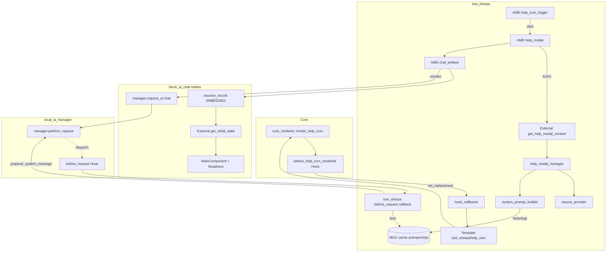
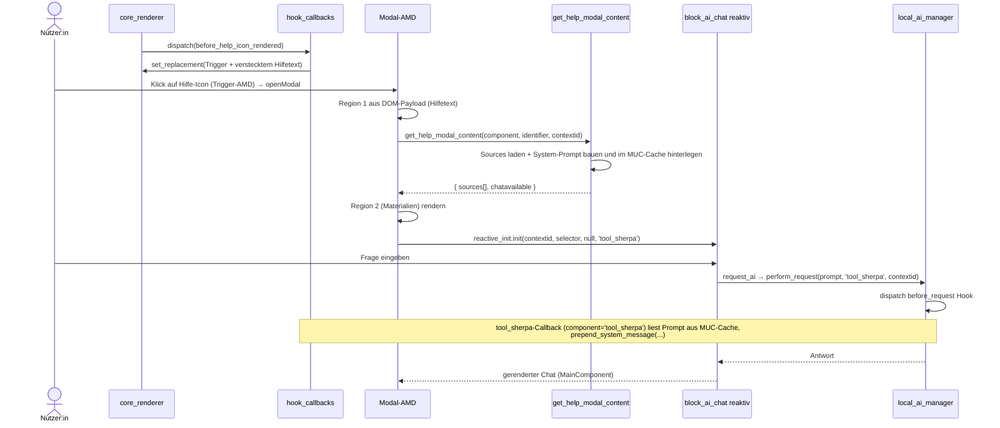

# Technische Spezifikation: Hilfe-Modal mit Support-Materialien und kontextbezogenem Chatbot

| Feld           | Wert                                                                 |
|----------------|----------------------------------------------------------------------|
| Plugin         | `tool_sherpa`                                                        |
| Status         | Entwurf – Kernentscheidungen getroffen                                         |
| Autor          | Dr. Peter Mayer                                                      |
| Copyright      | 2026 ISB Bayern                                                     |
| Basis-Hook     | `\core\hook\output\before_help_icon_rendered`                       |
| Abhängigkeiten | `local_ai_manager` 3.0 (`2026050500`, inkl. `before_request`-Hook), `block_ai_chat` 3.2 reaktiv (`2026050800`), `tiny_ai` |

---

## Inhaltsverzeichnis

1. [Ziel & Scope](#1-ziel--scope)
2. [Begriffe](#2-begriffe)
3. [Ist-Zustand](#3-ist-zustand)
4. [Zielbild (UX)](#4-zielbild-ux)
5. [Architekturüberblick](#5-architekturüberblick)
6. [Komponenten-Spezifikation](#6-komponenten-spezifikation)
7. [Backend (PHP)](#7-backend-php)
8. [Frontend (AMD & Templates)](#8-frontend-amd--templates)
9. [Datenbank](#9-datenbank)
10. [Konfiguration / Settings](#10-konfiguration--settings)
11. [Sicherheit (OWASP)](#11-sicherheit-owasp)
12. [Caching & Performance](#12-caching--performance)
13. [Barrierefreiheit & i18n](#13-barrierefreiheit--i18n)
14. [Teststrategie](#14-teststrategie)
15. [Rollout-Phasen](#15-rollout-phasen)
16. [Offene Punkte & Entscheidungen](#16-offene-punkte--entscheidungen)
17. [Auswirkungen auf bestehenden Code](#17-auswirkungen-auf-bestehenden-code)
18. [Anhang: Beispiel-Payloads](#18-anhang-beispiel-payloads)

---

## 1. Ziel & Scope

Die Moodle-Hilfe-Icons (`?`) zeigen heute beim Fokussieren/Klicken einen Bootstrap-Popover
(Tooltip) mit dem Hilfetext und ggf. einem „Mehr Hilfe"-Doku-Link. Diese Spezifikation
beschreibt, wie `tool_sherpa` über den Hook `before_help_icon_rendered` dieses Verhalten
ersetzt durch eine **Modal-Box** mit drei Bereichen:

1. **Hilfetext-Bereich** – identischer Inhalt wie der bisherige Tooltip (Hilfetext + Doku-Link).
2. **Support-Materialien** – zusätzliche, weiterführende Materialien (Tutorials etc.).
   Perspektivisch aus einer DB-Tabelle, in der ersten Ausbaustufe als **Dummy-URLs** für
   Demonstrationszwecke.
3. **Kontextbezogener Chatbot** – Einbettung des Chatbots aus `block_ai_chat` (analog zur
   Einbettung in `mod_aichat`), dessen **Persona** aus dem Kontext des jeweiligen Hilfe-Feldes
   abgeleitet wird (DB-Materialkontext + bisheriger Tooltip-Inhalt + Inhalt der
   Moodle-Dokumentation).

### In Scope
- Ersetzen des Popovers durch ein Modal via Hook-`set_replacement()`.
- Wiederverwendung des bestehenden Hilfetextes ohne Verlust von Platzhalter-Substitution (`$a`).
- Provider-Schicht für Support-Materialien (Dummy → DB).
- Einbettung des `block_ai_chat`-Chats mit feldspezifischer, serverseitig erzeugter Persona.
- Feature-Toggles, Capability-/Verfügbarkeitsprüfung, Caching, Barrierefreiheit, Tests.

### Out of Scope (dieser Spezifikation)
- Admin-UI zum Pflegen der Materialien (erst Phase 4).
- Mehrsprachige Pflege von Materialinhalten über die UI.
- Änderungen am AI-Backend (`local_ai_manager`).

---

## 2. Begriffe

| Begriff            | Bedeutung                                                                              |
|--------------------|----------------------------------------------------------------------------------------|
| Hilfe-Feld         | Konkretes `?`-Icon, identifiziert über `component` + `identifier`.                      |
| Tooltip-Inhalt     | `text` + `completedoclink` aus `help_icon::export_for_template()`.                      |
| Persona            | System-Prompt, der dem Chat-Modell die Rolle/den Kontext vorgibt.                       |
| Support-Material   | Weiterführende Ressource (Video, Anleitung, Doku-Link, H5P …) zu einem Hilfe-Feld.     |
| Modal-Region       | Einer der drei Inhaltsbereiche im Hilfe-Modal.                                          |

---

## 3. Ist-Zustand

### 3.1 Hook-Dispatch im Core

`core_renderer::render_help_icon()` erzeugt den Hook und wertet das Ergebnis aus
(`public/lib/classes/output/core_renderer.php`):

```php
protected function render_help_icon(help_icon $helpicon) {
    $context = $helpicon->export_for_template($this);

    $hook = new before_help_icon_rendered($helpicon, $this, $context);
    di::get(hook_manager::class)->dispatch($hook);

    // Vollständiger Ersatz, falls ein Plugin ihn gesetzt hat.
    if ($hook->get_replacement() !== null) {
        return $hook->get_replacement();
    }

    $output  = $hook->get_before_icon();
    $output .= $this->render_from_template('core/help_icon', $hook->get_templatecontext());
    $output .= $hook->get_after_icon();
    return $output;
}
```

**Konsequenz:** `set_replacement()` ist der korrekte Mechanismus, um den Popover vollständig
durch eine eigene Trigger-Markup-Struktur zu ersetzen.

### 3.2 Template-Kontext des Hilfe-Icons

`help_icon::export_for_template()` (`public/lib/classes/output/help_icon.php`) liefert u. a.:

| Property          | Inhalt                                                            |
|-------------------|------------------------------------------------------------------|
| `text`            | Hilfetext-HTML (bereits mit `$a` substituiert).                  |
| `completedoclink` | „Mehr Hilfe"-Link-HTML zur Moodle-Doku (falls vorhanden).       |
| `title`           | Titel (`helpprefix2`).                                            |
| `alt`             | Alt-Text des Icons.                                              |
| `icon`            | `pix_icon`-Export (`help`, `core`).                              |
| `url`             | `help.php`-URL (Standalone-Hilfeseite).                         |
| `ltr`             | Schreibrichtung.                                                  |

Das aktuelle Template `public/lib/templates/help_icon.mustache` rendert den Popover:

```html
<a class="btn btn-link p-0 me-2 icon-no-margin" role="button"
   data-bs-toggle="popover" data-bs-content="{{text}} {{completedoclink}}"
   data-bs-html="true" tabindex="0" data-bs-trigger="focus" ...>
  {{#pix}}help, core, {{{alt}}}{{/pix}}
</a>
```

> **Wichtig:** Der vollständige Hilfetext steckt bereits heute im DOM (Attribut
> `data-bs-content`). Das Einbetten desselben HTML in eine versteckte Modal-Region
> verschlechtert die Seitengröße also **nicht** gegenüber dem Status quo und bewahrt die
> `$a`-Substitution.

### 3.3 Vorhandenes `tool_sherpa`-Skeleton

- `classes/local/hook_callbacks.php`: `handle_before_help_icon_rendered()` hängt aktuell per
  `add_after_icon()` einen „Ask Sherpa"-Link an, der auf `support.php` zeigt –
  **diese Datei existiert noch nicht** und wird durch das Modal-Konzept abgelöst.
- `classes/local/support_manager.php`: kapselt Verfügbarkeit (`is_available()`),
  Purpose-Auflösung (`get_purpose()`) und einen Single-Prompt-Aufruf an `local_ai_manager`.
- `db/hooks.php`: registriert u. a. `before_help_icon_rendered` und
  `after_langpacks_updated` (Cache-Purge).
- Caches: `tool_sherpa/explanations` (Definition bereits vorhanden bzw. vorausgesetzt).
- Capabilities: `tool/sherpa:usesupport`, `tool/sherpa:editsupport`.
- Settings: `enabled`, `helpiconintegration`, `purpose`.

### 3.4 `block_ai_chat` – reaktive Architektur (jetzt installiert)

Im Workspace liegt nun **`block_ai_chat` 3.2 (`version 2026050800`)** mit der **reaktiven**
Frontend-Architektur (das früher nötige Upgrade von 2.1.1 ist **erledigt**). `local_ai_manager`
ist **3.0 (`2026050500`)**, `tiny_ai` vorhanden. `mod_aichat` setzt genau diese Stände voraus.
Eckpunkte:

- Einstiegspunkt **`block_ai_chat/reactive_init`** (`amd/src/reactive_init.js`):
  ```js
  init(contextid, mainElementSelector, modal = null, component = 'block_ai_chat')
  ```
  - `modal = null` ⇒ **EMBEDDED-Modus** (mehrere Embeds pro Seite erlaubt); ein Modal-Objekt ⇒
    MODAL-Modus (nur eines pro Seite).
  - Das Hauptelement braucht ein eindeutiges `data-id`-Attribut.
- Der **Initialzustand kommt vom Server** über die External Function
  **`block_ai_chat_get_initial_state(contextid, component)`** → `\block_ai_chat\manager`.
  Diese verlangt `require_capability('block/ai_chat:view', $context)`.
- Auf dem Initialzustand baut ein **`core/reactive`**-Store (`Mutations`, `state`); die UI wird
  vollständig von `block_ai_chat/components/main` (MainComponent) reaktiv erzeugt.
- **System-Prompt:** `block_ai_chat::request_ai()` (chat) prepend't zwar die kontextgebundene
  Persona, ruft dann aber `local_ai_manager\manager::perform_request($prompt, $component, …)` auf.
  Dort wird der Hook **`\local_ai_manager\hook\before_request`** dispatcht – der **vorhandene**
  Injektionspunkt für einen Feld-System-Prompt **ohne** Persona und **ohne** `block_ai_chat`-
  Änderung (Details in 6.4.1). Für den **Agent**-Modus existiert zusätzlich ein pagetype-basiertes
  Zusatzkontext-System (`block_ai_chat_aicontext`) – hier nicht relevant.

### 3.5 `mod_aichat` als Referenzmuster (jetzt verfügbar)

`mod_aichat` „wrappt" eine `block_ai_chat`-Instanz in einer Aktivität. Das konkrete
Einbettungsmuster (`mod/aichat/`):

1. **`view.php`** rendert einen leeren Container und startet das AMD-Modul:
   ```php
   echo html_writer::tag('div', '', ['data-mod_aichat-element' => 'embeddingmodalcontainer']);
   $PAGE->requires->js_call_amd('mod_aichat/embedded_modal', 'init', [
       'contextid' => $context->id,
       'cmid' => $cm->id,
   ]);
   ```
2. **`amd/src/embedded_modal.js`** rendert das Container-Template und ruft `reactive_init` im
   EMBEDDED-Modus mit eigenem **Komponentennamen** auf:
   ```js
   import * as ReactiveInit from 'block_ai_chat/reactive_init';
   const {html, js} = await Templates.renderForPromise('mod_aichat/embedded_modal', {uniqueId});
   Templates.replaceNodeContents(container, html, js);
   await ReactiveInit.init(contextid,
       `[data-block_aichat-element="mainelement"][data-id="${uniqueId}"]`, null, 'mod_aichat');
   ```
3. **`templates/embedded_modal.mustache`** liefert das Hauptelement
   (`data-block_aichat-element="mainelement"` + `data-id="{{uniqueId}}"`), in das MainComponent
   die Chat-Unterkomponenten lädt.
4. Persona/Optionen werden **pro Modulkontext** gespeichert; `aichat_delete_instance()` räumt
   `block_ai_chat_personas_selected`/`block_ai_chat_options` per `contextid` auf.

> **Folgerung für Sherpa:** Das „analog zu `mod_aichat`"-Einbetten ist eindeutig definiert
> (`reactive_init` im EMBEDDED-Modus mit `component='tool_sherpa'`), die reaktive `block_ai_chat`
> 3.2 ist **installiert**, und die feldspezifische System-Prompt-Injektion (Req 4) ist über den
> **vorhandenen** Hook `\local_ai_manager\hook\before_request` gelöst – **ohne** `block_ai_chat`-
> Änderung (siehe 6.4.1).

---

## 4. Zielbild (UX)

Klick (oder Tastatur-Aktivierung) auf ein Hilfe-Icon öffnet ein zentriertes Modal. Das Icon
selbst bleibt optisch unverändert (gleiches `?`-Pixel-Icon, gleiche ARIA-Semantik).

```
┌──────────────────────────────────────────────────────────────┐
│  ?  Hilfe: „Kurs sichtbar"                              [ ✕ ] │
├──────────────────────────────────────────────────────────────┤
│  REGION 1 – Hilfetext                                         │
│  ───────────────────────────────────────────────────────────│
│  <identischer Inhalt wie bisheriger Tooltip>                  │
│  ↳ Mehr Hilfe (Doku-Link, öffnet in neuem Tab)               │
│                                                              │
│  REGION 2 – Weiterführende Materialien                       │
│  ───────────────────────────────────────────────────────────│
│  ▸ 🎬 Video-Tutorial: „Kurssichtbarkeit steuern"  (extern)   │
│  ▸ 📄 Schritt-für-Schritt-Anleitung               (extern)   │
│  ▸ ❓ FAQ: Sichtbarkeit & Einschreibung           (extern)   │
│                                                              │
│  REGION 3 – Sherpa-Chat (kontextbezogen)                     │
│  ───────────────────────────────────────────────────────────│
│  [ Chatverlauf …                                          ]  │
│  [ Eingabe …                                       ] [ ➤ ]   │
└──────────────────────────────────────────────────────────────┘
```

**Regionssichtbarkeit (unabhängig schaltbar):**

| Region | Bedingung |
|--------|-----------|
| 1 Hilfetext   | immer (sofern Modal aktiv).                                                       |
| 2 Materialien | `showmaterials` aktiv **und** Provider liefert ≥ 1 Material.                       |
| 3 Chat        | `showchat` aktiv **und** `support_manager::is_available($context)` == true **und** `block/ai_chat:view` (reaktive `block_ai_chat` vorausgesetzt). |

**Progressive Enhancement:** Der Trigger wird als `<a href="help.php?...">` gerendert. Ohne
JavaScript verhält er sich wie heute (Standalone-Hilfeseite). Mit JavaScript wird der
Default-Klick unterdrückt und stattdessen das Modal geöffnet.

---

## 5. Architekturüberblick

### 5.1 Komponenten



### 5.2 Ablauf (Sequenz)



---

## 6. Komponenten-Spezifikation

### 6.1 Hook-Integration & Trigger (Req 1)

Die Callback-Methode `handle_before_help_icon_rendered()` wird umgestellt:

- **Bisher:** `add_after_icon()` mit Link auf `support.php`.
- **Neu:** `set_replacement()` mit dem gerenderten Template `tool_sherpa/help_icon`.

Verhalten:

```php
public static function handle_before_help_icon_rendered(before_help_icon_rendered $hook): void {
    global $PAGE, $OUTPUT;

    // Feature-Toggle: Modal nur, wenn aktiviert; sonst Default-Popover beibehalten.
    if (!get_config('tool_sherpa', 'enabled')
            || !get_config('tool_sherpa', 'helpiconintegration')
            || !get_config('tool_sherpa', 'usemodal')) {
        return;
    }

    $context = $PAGE->context ?? \context_system::instance();

    // Leichte Berechtigung für das Modal selbst (Hilfetext/Materialien).
    if (!has_capability('tool/sherpa:usesupport', $context)) {
        return;
    }

    $helpicon = $hook->get_helpicon();
    $ctx = $hook->get_templatecontext(); // text, completedoclink, icon, title, url, ltr …

    // Sherpa-spezifische Felder ergänzen.
    $ctx->component  = $helpicon->component;
    $ctx->identifier = $helpicon->identifier;
    $ctx->contextid  = $context->id;
    $ctx->chatavailable = get_config('tool_sherpa', 'showchat')
        && support_manager::is_available($context);
    $ctx->showmaterials = (bool) get_config('tool_sherpa', 'showmaterials');

    // Trigger-Button + versteckte Hilfetext-Payload rendern und Icon ersetzen.
    $hook->set_replacement($OUTPUT->render_from_template('tool_sherpa/help_icon', $ctx));

    // Einmalige, delegierte Trigger-Registrierung pro Seite (idempotent).
    $PAGE->requires->js_call_amd('tool_sherpa/help_icon_trigger', 'init');
}
```

**Designentscheidung – Hilfetext inline statt nachladen:** Da `text`/`completedoclink`
bereits serverseitig (inkl. `$a`) vorliegen, werden sie direkt in eine versteckte Region des
Trigger-Templates eingebettet. Das garantiert **identischen** Inhalt zum bisherigen Tooltip
(Req 2) ohne zusätzlichen Roundtrip und ohne `$a`-Verlust. Materialien und Persona werden
hingegen **lazy** per Webservice geladen (DB-/Doku-abhängig, größer, cachebar).

### 6.2 Bereich 1 – Hilfetext im Modal (Req 2)

- Quelle: `text` + `completedoclink` aus dem Hook-Template-Kontext.
- Darstellung: 1:1 wie im Popover; `completedoclink` öffnet weiterhin in neuem Tab.
- Escaping: Werte sind bereits formatiertes Hilfetext-HTML (`get_formatted_help_string`); im
  Template als `{{{text}}}`/`{{{completedoclink}}}` ausgegeben (kein doppeltes Escaping).
- Das Trigger-Template legt diesen Inhalt in ein verstecktes Element
  (`<template data-region="sherpa-helptext">…</template>`), aus dem das Modal-AMD beim Öffnen
  kopiert.

### 6.3 Bereich 2 – Support-Materialien (Req 3)

Die Materialien stammen aus der **vorhandenen DB-Struktur** des Plugins (`db/install.xml`, siehe
Abschnitt 9): `tool_sherpa_source` (URL-Quellen), `tool_sherpa_placement` (UI-Orte) und
`tool_sherpa_mapping` (n:m). Für ein Hilfe-Icon ist der relevante Placement-Typ
**`placement::TYPE_LANGSTRING`** (`'langstring'`), dessen `value` die Hilfe-Sprachzeichenkette
identifiziert (Moodle-Langstring-Syntax: `value = "{identifier},{component}"`, kommagetrennt).

**Auflösung der Materialien zu einem Hilfe-Icon:**
1. Placement mit `type = 'langstring'` und `value = "{identifier},{component}"` suchen.
2. Über `tool_sherpa_mapping` die zugeordneten `tool_sherpa_source`-Einträge laden.
3. Deren `url` als Liste von Materialien (Links) zurückgeben.

Da `tool_sherpa_source` **nur ein `url`-Feld** besitzt, gibt es serverseitig keinen Titel/Typ.
Das Rendering leitet eine Anzeige aus der URL ab (Host/Pfad oder generisches Label) und kann den
Typ optional heuristisch aus Endung/Domain ableiten (Icon).

DTO `source` (read-only Sicht auf `tool_sherpa_source`):

| Feld  | Typ    | Beschreibung                 |
|-------|--------|------------------------------|
| `id`  | int    | Datensatz-ID.                |
| `url` | string | Ziel-URL (das einzige Feld). |

> **Demo-Inhalte:** Zur Demonstration werden die drei Tabellen mit Beispiel-Quellen (Dummy-URLs
> zu Tutorials) und passenden `langstring`-Placements befüllt (z. B. via `db/install.php` oder
> einem CLI-Seed). Es werden **keine** hartkodierten Materialien mehr im Code gehalten – die
> Inhalte kommen ausschließlich aus der Datenstruktur.

Sichtbarkeit: Region 2 wird nur gerendert, wenn `showmaterials` aktiv ist **und** mindestens eine
gemappte Quelle existiert.

### 6.4 Bereich 3 – Chatbot mit Feld-System-Prompt (Req 4)

**Ziel:** Den Chat aus `block_ai_chat` **analog zu `mod_aichat`** in der Modal-Region einbetten.
Statt einer Persona wird dem Chat ein **einfacher, feldbezogener System-Prompt** mitgegeben
(Entscheidung: keine Persona, kein Eintrag in `block_ai_chat_personas`, so einfach wie möglich).

#### 6.4.1 Einbettung (fix: analog `mod_aichat`)

Die Einbettung erfolgt **1:1 wie `mod_aichat`** (siehe 3.5): ein Container im Sherpa-Modal mit
`data-block_aichat-element="mainelement"` + eindeutiger `data-id`, dann

```js
import * as ReactiveInit from 'block_ai_chat/reactive_init';
await ReactiveInit.init(contextid, selector, null, 'tool_sherpa'); // EMBEDDED-Modus
```

Beide technischen Voraussetzungen sind nach den Plugin-Updates **erfüllt**:

1. **Reaktive `block_ai_chat` vorhanden** (≥ 2026020100): installiert ist **3.2 (`2026050800`)**,
   `local_ai_manager` ist **3.0 (`2026050500`)**, `tiny_ai` vorhanden. Kein Upgrade nötig.
2. **System-Prompt-Injektion:** Der Hook **`\local_ai_manager\hook\before_request`** ist in
   `local_ai_manager` **implementiert** (`local/ai_manager/classes/hook/before_request.php`,
   Spec `docs/hook_before_request_spec.md`). Er wird in
   `local_ai_manager\manager::perform_request()` **nach** den Access-Checks und **vor**
   `format_prompt_text()` dispatcht und bietet u. a. `prepend_system_message(string $message)`,
   `append_system_message()`, `set_prompttext()`, `get_component()`, `get_purpose()`,
   `get_context()`. Da `block_ai_chat::request_ai()` intern
   `perform_request($prompt, $this->component, …)` mit `component='tool_sherpa'` aufruft (dem
   Embedding-Component aus `reactive_init`), kann `tool_sherpa` den Feld-System-Prompt injizieren –
   **ohne Eingriff in `block_ai_chat`** und **ohne** Persona-Persistenz.

   > `tool_sherpa` registriert einen `before_request`-Callback (`db/hooks.php`). Der Callback prüft
   > `get_component() === 'tool_sherpa'` (und Purpose `chat`) und ruft
   > `prepend_system_message($fieldprompt)` mit dem zuvor hinterlegten Feld-Prompt auf.

**Wie der Feld-Prompt zum Callback gelangt (Bridge):** Da der Chat-Request nur
`contextid`+`component` trägt (nicht das konkrete Feld) und pro Nutzer:in **immer nur ein**
Sherpa-Modal offen ist, hinterlegt `tool_sherpa` den aktuellen System-Prompt beim Öffnen des
Modals in einem **MUC-Cache** (`db/caches.php`-Definition `activeprompt`, `MODE_APPLICATION`,
kurze TTL), keyed by `(userid, contextid)`. Der `before_request`-Callback liest genau diesen Wert.

> **Warum kein `$SESSION`?** Der gesamte Ablauf ist AJAX (`get_help_modal_content` schreibt, der
> Chat-Request liest). Ein `$SESSION`-Schreibzugriff hielte den **Session-Lock** und würde den
> nachfolgenden Chat-AJAX serialisieren. Ein `MODE_APPLICATION`-Cache (Cache API) vermeidet das
> Session-Locking und ist der idiomatische Moodle-Weg für solchen transienten Cross-Request-
> Zustand. Kein `instancekey`-Plumbing, keine zusätzlichen Chat-Webservices in `tool_sherpa` nötig.

#### 6.4.2 System-Prompt-Erzeugung (`system_prompt_builder`)

Der System-Prompt wird **serverseitig** gebaut (Caching/Escaping) und beim Öffnen des Modals
transient hinterlegt (6.4.1). Eingangsgrößen – **bewusst minimal**:

1. **Feldidentität:** `component` + `identifier` + `title`.
2. **Hilfetext:** der Tooltip-Hilfetext (`text`), als Plaintext normalisiert
   (`html_to_text(format_text(...))`). Die `$a`-Substitution ist bereits enthalten
   (Inline-Hilfetext genügt, Entscheidung 3).
3. **Quellen aus der DB:** die `url`s der gemappten `tool_sherpa_source`-Einträge (Req 3) als
   Liste „weiterführender Materialien".
4. **Moodle-Dokumentation:** **standardmäßig aus** (`includedocs=0`, Entscheidung 4); nur wenn
   aktiviert, ein kurzer Doku-Auszug.

Ergebnis: ein **String** (kein Persona-Objekt). Beispiel-Schablone (über Sprachstring
`systemprompttemplate` lokalisierbar):

```text
Du bist „Sherpa", ein hilfsbereiter Assistent der Moodle-Lernplattform.
Du unterstützt beim Verständnis des Bedienelements „{title}" ({identifier},{component}).

Offizieller Hilfetext:
---
{helptext_plain}
---
Weiterführende Quellen (URLs): {source_urls}

Antworte in einfacher, klarer Sprache und bleibe beim genannten Kontext.
```

Es wird **kein** Persona-Datensatz erzeugt; der String wird ausschließlich transient an den
Chat-Request übergeben (6.4.1).

#### 6.4.3 Konversations-Handling

- `contextid`: aktueller Seitenkontext (`$PAGE->context->id`).
- Zustand, Konversations-ID, History sowie Senden/Empfangen laufen vollständig über die reaktive
  `block_ai_chat`-Pipeline (`get_initial_state` + `Mutations`), aufgerufen mit
  `component='tool_sherpa'` – **keine** eigenen Chat-Webservices in `tool_sherpa`.
- Capability-Gate des Embeds: `block/ai_chat:view` (zusätzlich zu `local/ai_manager:use`).
- Verläufe werden unter `component='tool_sherpa'` geführt (getrennt von echten Block-Chats). Da
  der reaktive State nur `contextid`+`component` unterscheidet, teilen sich die Hilfe-Felder einer
  Seite einen Verlauf – für die Demo akzeptiert.

---

## 7. Backend (PHP)

> **Coding-Standards-Compliance (gemäß `.github/copilot-instructions.md`).** Jede neue Datei
> trägt den GPL-Header sowie `@copyright  2026 ISB Bayern` direkt gefolgt von
> `@author     Dr. Peter Mayer`. DB-Entitäten nutzen die **Persistent API** (§4.2), Zeitlogik die
> **Clock API** (§4.14), Logging das **Event-System** (keine eigenen Logdateien, §4.17), die
> Service-Auflösung den **DI-Container** (§4.7). Capabilities ohne Unterstriche und auf dem
> niedrigsten sinnvollen Kontextlevel (§10). Der `templates/`-Ordner enthält ausschließlich
> `.mustache`-Dateien.

Neue/zu ändernde Klassen unter `public/admin/tool/sherpa/classes/`:

| Datei | Verantwortung |
|-------|---------------|
| `local/hook_callbacks.php` *(ändern)* | `set_replacement()` statt `add_after_icon()`; Trigger-AMD laden. **Plus** `local_ai_manager`-`before_request`-Callback (System-Prompt-Injektion, 6.4.1). |
| `local/help_modal_manager.php` *(neu)* | Aggregiert Hilfetext-Metadaten + Quellen; baut/hinterlegt den System-Prompt für den Webservice. |
| `local/source_provider.php` *(neu)* | Liefert die gemappten Quellen-URLs zu einem `langstring`-Placement (Tabellen `tool_sherpa_source`/`_placement`/`_mapping`). |
| `source.php` / `placement.php` / `mapping.php` *(vorh./neu)* | Persistent-Entitäten zu den DB-Tabellen (`placement.php` mit Typ-Konstanten ist bereits vorhanden). |
| `local/system_prompt_builder.php` *(neu)* | Baut den Feld-System-Prompt-**String** aus Hilfetext + Quellen (keine Persona). |
| `external/get_help_modal_content.php` *(neu)* | AJAX-Endpunkt: Quellen + Verfügbarkeit; hinterlegt den System-Prompt transient. |

### 7.1 Webservice `get_help_modal_content`

```php
public static function execute_parameters(): external_function_parameters {
    return new external_function_parameters([
        'component'  => new external_value(PARAM_COMPONENT, 'Frankenstyle component of the help string'),
        'identifier' => new external_value(PARAM_RAW, 'Help string identifier'),
        'contextid'  => new external_value(PARAM_INT, 'Context id of the current page'),
    ]);
}

public static function execute(string $component, string $identifier, int $contextid): array {
    $params = self::validate_parameters(self::execute_parameters(),
        ['component' => $component, 'identifier' => $identifier, 'contextid' => $contextid]);

    $context = \core\context_helper::instance_by_id($params['contextid']);
    self::validate_context($context);
    require_capability('tool/sherpa:usesupport', $context);

    // Identifier gegen tatsächlich existierende Hilfestrings absichern.
    if (!get_string_manager()->string_exists($params['identifier'], $params['component'])) {
        throw new \invalid_parameter_exception('Unknown help identifier');
    }

    return help_modal_manager::get_modal_payload(
        $params['component'], $params['identifier'], $context);
}

public static function execute_returns(): external_single_structure {
    return new external_single_structure([
        'title'         => new external_value(PARAM_TEXT, 'Help title'),
        'chatavailable' => new external_value(PARAM_BOOL, 'Whether the chat region is available'),
        // Kein Persona-Objekt: der System-Prompt wird serverseitig transient hinterlegt
        // (6.4.1) und über den local_ai_manager-before_request-Hook injiziert – nicht an den Client geliefert.
        'sources'       => new external_multiple_structure(new external_single_structure([
            'url' => new external_value(PARAM_URL, 'Source URL (from tool_sherpa_source)'),
        ])),
    ]);
}
```

> Hinweis: `text`/`completedoclink` werden bewusst **nicht** über diesen Service geliefert
> (sie sind bereits im DOM, siehe 6.1). Der **System-Prompt** wird serverseitig erzeugt
> (`system_prompt_builder`) und beim Aufruf **im MUC-Cache hinterlegt** (`activeprompt`,
> `MODE_APPLICATION`, keyed by `(userid, contextid)` – **nicht** `$SESSION`, siehe 6.4.1); der
> `before_request`-Callback liest ihn beim Chat-Request. Er wird **nicht** an den Client
> ausgeliefert (kein Persona-Objekt).

### 7.2 `source_provider` (Quellen aus der DB-Struktur)

```php
public static function get_sources_for_help(string $component, string $identifier): array {
    global $DB;
    if (!get_config('tool_sherpa', 'showmaterials')) {
        return [];
    }
    // Hilfe-Icon ⇒ Placement 'langstring', value = "{identifier},{component}"
    // (typische Moodle-Langstring-Syntax, vgl. get_string($identifier, $component)).
    $value = $identifier . ',' . $component;
    $sql = "SELECT s.id, s.url
              FROM {tool_sherpa_source} s
              JOIN {tool_sherpa_mapping} m ON m.source = s.id
              JOIN {tool_sherpa_placement} p ON p.id = m.placement
             WHERE p.type = :type AND p.value = :value";
    return $DB->get_records_sql($sql, [
        'type' => \tool_sherpa\placement::TYPE_LANGSTRING,
        'value' => $value,
    ]);
}
```

> **Datenherkunft:** Inhalte stammen ausschließlich aus `tool_sherpa_source` /
> `tool_sherpa_placement` / `tool_sherpa_mapping` (kein hartkodiertes Material). Zugriff
> vorzugsweise über Persistent-Entitäten (§4.2: `source`, `placement`, `mapping`); die
> Roh-SQL-Skizze oben dient nur der Verdeutlichung des Joins.
>
> **Demo-Seed:** Die drei Tabellen werden mit Beispiel-Quellen (Dummy-Tutorial-URLs) und
> `langstring`-Placements befüllt (z. B. `db/install.php`/CLI), damit die Materialien-Region
> ohne Admin-UI demonstrierbar ist.

---

## 8. Frontend (AMD & Templates)

### 8.1 Templates (`public/admin/tool/sherpa/templates/`)

| Template | Zweck |
|----------|-------|
| `help_icon.mustache` | Ersatz für `core/help_icon`: Trigger-`<a>` (mit `href` auf `help.php` als Fallback) + verstecktes `<template data-region="sherpa-helptext">`. Trägt `data-component`, `data-identifier`, `data-contextid`, `data-chatavailable`, `data-showmaterials`. |
| `help_modal_body.mustache` | Drei Regionen (Hilfetext, Materialien, Chat). |
| `material_item.mustache` | Einzelne Quelle: sicherer Link auf die `url` (abgeleitetes Label). |
| `chat_embed.mustache` | Container für das reaktive `block_ai_chat`-Embed mit `data-block_aichat-element="mainelement"` und eindeutiger `data-id` – analog zu `mod_aichat/embedded_modal.mustache`. |

Der Chat rendert **kein** eigenes Nachrichten-Markup: die reaktiven `block_ai_chat`-Komponenten
(MainComponent) übernehmen Aufbau und Darstellung vollständig.

### 8.2 AMD-Module (`public/admin/tool/sherpa/amd/src/`)

| Modul | API | Aufgabe |
|-------|-----|---------|
| `help_icon_trigger.js` | `init()` | **Einmalige**, delegierte Klick-/Keyboard-Behandlung auf `[data-action="tool-sherpa-help"]`. Verhindert Default-Navigation, ruft `help_modal.open(triggerEl)`. Idempotent (Mehrfach-Init no-op). |
| `help_modal.js` | `open(triggerEl)` | Liest DOM-Payload (Hilfetext) + Datenattribute; erzeugt/wiederverwendet **eine** `core/modal`-Instanz; befüllt Region 1 sofort; lädt Region 2/3 lazy via `get_help_modal_content`; bindet den Chat. Cacht Inhalte je `component\|identifier` für die Session. |
| `chat_embed.js` | `mount(container, {contextid, uniqueId})` | Rendert `tool_sherpa/chat_embed` und ruft `reactive_init.init(contextid, selector, null, 'tool_sherpa')` – analog zu `mod_aichat/embedded_modal`. Der Feld-System-Prompt wurde serverseitig (beim `get_help_modal_content`-Aufruf) hinterlegt und wird über den `local_ai_manager`-`before_request`-Hook injiziert (6.4.1). |

> **Build-Hinweis (Projektvorgabe §5/§2):** AMD-Module werden **außerhalb** von Docker gebaut:
> `cd ~/dev/vanilla_moodle_sc/public/admin/tool/sherpa && nvm use && npx grunt amd --force`
> (`nvm use` liest `.nvmrc`). Danach Caches leeren:
> `cd ~/dev/vanilla_moodle && ./purge_caches.sh`. JS folgt §10: Selektion über Data-Attribute,
> Rendering ausschließlich über `core/templates` (keine HTML-String-Konkatenation, weder mit `+`
> noch mit Template-Literals), Event-Listener gegen Mehrfachanhängung absichern, Disabled-/Hidden-
> State des Sende-Buttons behandeln, keine unnötigen Timeouts.

### 8.3 Mehrfach-Icons & geteiltes Modal

- Genau **eine** Modal-Instanz pro Seite, die bei jedem Öffnen neu befüllt wird.
- Event-Delegation am `document` → funktioniert auch für dynamisch nachgeladene Icons.
- Fokus-Management: Fokus ins Modal, `ESC` schließt, Rückgabe des Fokus an den auslösenden
  Trigger.

---

## 9. Datenbank

Die Tabellen sind **bereits vorhanden** (`db/install.xml`, `VERSION 20260630`) und werden
unverändert genutzt. Drei Tabellen plus die Typ-Konstanten-Klasse `tool_sherpa\placement`:

**`tool_sherpa_source`** – Quellen, die Sherpa zur Unterstützung nutzt:

| Feld  | Typ        | Null | Beschreibung      |
|-------|------------|------|-------------------|
| `id`  | int(10) PK | nein | Primärschlüssel.  |
| `url` | char(1333) | nein | URL der Quelle.   |

**`tool_sherpa_placement`** – ein Ort in der Oberfläche:

| Feld    | Typ        | Null | Beschreibung                                                        |
|---------|------------|------|--------------------------------------------------------------------|
| `id`    | int(10) PK | nein | Primärschlüssel.                                                   |
| `type`  | char(100)  | nein | Typ (`formelement` \| `langstring` \| `path`; Konstanten in `placement`). |
| `value` | char(1333) | nein | Konkreter Wert/Selektor je Typ (Hilfe-Icon: `"{identifier},{component}"`). |

**`tool_sherpa_mapping`** – n:m zwischen Placement und Source:

| Feld        | Typ        | Null | Beschreibung                  |
|-------------|------------|------|-------------------------------|
| `id`        | int(10) PK | nein | Primärschlüssel.              |
| `placement` | int(10) FK | nein | → `tool_sherpa_placement.id`. |
| `source`    | int(10) FK | nein | → `tool_sherpa_source.id`.    |

Placement-Typen (`classes/placement.php`, bereits vorhanden):

| Konstante | Wert | Bedeutung |
|-----------|------|-----------|
| `placement::TYPE_FORMELEMENT` | `formelement` | An ein Formularelement gebunden. |
| `placement::TYPE_LANGSTRING`  | `langstring`  | An eine Sprachzeichenkette gebunden (**Hilfe-Icons**). |
| `placement::TYPE_PATH`        | `path`        | An einen Pfad gebunden. |

> **Hilfe-Icon-Mapping:** Ein Hilfe-Icon entspricht einem Placement vom Typ `langstring` mit
> `value = "{identifier},{component}"` (typische Moodle-Langstring-Syntax, kommagetrennt – wie
> `get_string($identifier, $component)`). Die gemappten Sources liefern die Materialien (Req 3)
> und fließen in den Feld-System-Prompt (Req 4) ein.
>
> Datei-Uploads als Quelle sind aktuell nicht vorgesehen (`tool_sherpa_source` hat nur `url`);
> bei Bedarf später über die Moodle File-API ergänzbar.

---

## 10. Konfiguration / Settings

Erweiterung von `settings.php`:

| Setting | Default | Bedeutung |
|---------|---------|-----------|
| `enabled` *(vorhanden)* | an | Master-Schalter des Plugins. |
| `helpiconintegration` *(vorhanden)* | an | Integration an Hilfe-Icons. |
| `usemodal` *(neu)* | **aus** | Popover durch Modal ersetzen (Req 1). **Default = klassischer Popover** (Entscheidung 6); per Admin-Setting aktivierbar. |
| `showmaterials` *(neu)* | an | Region 2 (Materialien) anzeigen. |
| `showchat` *(neu)* | an | Region 3 (Chat) anzeigen. |
| `systemprompttemplate` *(neu)* | (Vorgabe) | Schablone für den Feld-System-Prompt (Platzhalter `{title}`, `{component}`, `{identifier}`, `{helptext_plain}`, `{source_urls}`). |
| `includedocs` *(neu)* | **aus** | Moodle-Doku-Inhalt in den System-Prompt einbeziehen (Netzwerkabruf, Entscheidung 4). |
| `docsfetchtimeout` *(neu)* | 2 s | Timeout für den optionalen Doku-Abruf (nur bei `includedocs`). |
| `purpose` *(vorhanden)* | `chat` | `local_ai_manager`-Purpose für den Chat. |

Fallback-Logik: Ist `usemodal` aus (**Default**), setzt der Callback **kein** `set_replacement()`
→ Core rendert den unveränderten Popover (volle Rückwärtskompatibilität).

---

## 11. Sicherheit (OWASP)

| Thema | Maßnahme |
|-------|----------|
| Eingabevalidierung | `component` → `PARAM_COMPONENT`; `contextid` → `PARAM_INT`; `identifier` → `PARAM_RAW` **plus** Existenzprüfung über `string_exists()`. |
| Kontext & Rechte | `validate_context()` + `require_capability('tool/sherpa:usesupport', $context)`; Chat zusätzlich `local/ai_manager:use`. |
| Ausgabe-Escaping | Hilfetext über `format_text`/`get_formatted_help_string` (bereits bereinigt); Quell-URLs via `s()`; System-Prompt-Plaintext via `html_to_text`. |
| Link-Sicherheit | Quell-/Doku-Links mit `clean_param(PARAM_URL)`, gerendert mit `target="_blank" rel="noopener noreferrer"`. |
| SSRF (Doku-Abruf) | Nur Abruf von der konfigurierten Doku-Host-Allowlist (`$CFG->docroot`-Host); kurzer Timeout, Größenlimit; **niemals** nutzergelieferte URLs abrufen; Ergebnis sanitisieren. |
| CSRF | Standard-Moodle-AJAX (Sesskey) für alle External-Services. |
| Injektion | Keine Roh-SQL: ausschließlich `$DB`-Parameter-API (benannte Parameter). |
| Prompt-Sicherheit | System-Prompt serverseitig erzeugt; nutzergelieferte Frage wird als reine User-Message übergeben, nicht in den System-Prompt interpoliert. |

---

## 12. Caching & Performance

- **Modal-Inhalt/System-Prompt:** Cache `tool_sherpa/explanations` (vorhanden) bzw. neuer
  Application-Cache, Key `sha1(component|identifier|lang)`.
- **Feld-System-Prompt-Bridge:** eigener MUC-Cache `activeprompt` (`MODE_APPLICATION`, kurze TTL),
  keyed by `(userid, contextid)` – Brücke vom Modal-Öffnen zum `before_request`-Callback. Bewusst
  **kein** `$SESSION` (vermeidet Session-Lock im AJAX-Fluss).
- **Doku-Auszug:** separater Application-Cache mit TTL (Netzwerkabruf teuer; nur bei `includedocs`).
- **Invalidierung:** bestehender `after_langpacks_updated`-Callback purged Caches; bei Änderung
  der Sources/Mappings ebenfalls purgen.
- **DOM-Last:** Trigger-Markup minimal; Hilfetext steckt – wie heute – ohnehin im DOM.
- **Lazy-Load:** Quellen/System-Prompt erst beim ersten Öffnen je Feld; clientseitiger
  Session-Cache verhindert Mehrfachabrufe.
- **Ein Modal/Seite:** spart DOM und Initialisierung bei vielen Icons.

---

## 13. Barrierefreiheit & i18n

- Trigger behält `role`, `aria-label`, Tastaturbedienbarkeit; Aktivierung per `Enter`/`Space`.
- Modal nutzt `core/modal` (Fokusfalle, `aria-modal`, `ESC`, Fokusrückgabe).
- Materialien als semantische Liste; externe Links mit erkennbarem „öffnet in neuem Tab"-Hinweis.
- Alle sichtbaren Zeichenketten als Sprachstrings in `lang/en/tool_sherpa.php`
  (neu u. a. `systemprompttemplate`, `chatregiontitle`, `materialsregiontitle`,
  `helpregiontitle`, `opensinnewtab`).

---

## 14. Teststrategie

### 14.1 Lokale Ausführung (moodle-docker-Wrapper)

Alle Skripte laufen aus dem Tooling-Repo `~/dev/vanilla_moodle`, mit **workspace-relativen**
Pfaden und **ohne Pipes/Redirects/`grep`** (Vorgabe §0.5/§2 der `.github/copilot-instructions.md`):

```bash
cd ~/dev/vanilla_moodle

# Coding- & PHPDoc-Standards (phpcs deckt beides ab; KEIN separates moodlecheck.sh)
./codechecker.sh public/admin/tool/sherpa
./codechecker_autofix.sh public/admin/tool/sherpa

# PHPUnit-Umgebung nach Änderungen an tests/ oder db/ neu initialisieren
./phpunitinit.sh

# Gesamte Plugin-Testsuite (Testsuite statt --filter/Pfad)
./phpunit.sh --testsuite=tool_sherpa_testsuite

# Behat inkl. Selenium für @javascript-Szenarien
./behatinit.sh
./seleniumup.sh
./behat.sh --tags=@tool_sherpa

# AMD-Build (außerhalb Docker) + Caches leeren
cd ~/dev/vanilla_moodle_sc/public/admin/tool/sherpa && nvm use && npx grunt amd --force
cd ~/dev/vanilla_moodle && ./purge_caches.sh
```

### 14.2 Testebenen

| Ebene | Inhalt |
|-------|--------|
| PHPUnit | `source_provider` (Auflösung Placement→Mapping→Source); `system_prompt_builder` (Prompt-Aufbau, Doku abschaltbar); `get_help_modal_content` (Param-Validierung, Capability, unbekannter Identifier, System-Prompt wird hinterlegt); `is_available()`-Gating. |
| Behat | `usemodal` an: Klick auf Hilfe-Icon öffnet Modal; Region 1 zeigt Hilfetext; Quellen gelistet (Demo-Seed); Chat-Region nur bei verfügbarer KI (gemockt); `usemodal` aus → klassischer Popover; Fallback ohne JS → `help.php`. |
| Jest | `help_icon_trigger` (Delegation, Idempotenz, Default-Unterdrückung); `help_modal` (DOM-Payload, Lazy-Load, Session-Cache); `chat_embed` (Aufruf von `reactive_init.init` mit `'tool_sherpa'`, mit gemocktem Modul). |

### 14.3 Testkonventionen (verbindlich, §7/§10)

- Testklassen `final` und `extends \advanced_testcase`; **`@covers` pro Testmethode**
  (z. B. `@covers \tool_sherpa\local\system_prompt_builder::build_for_help`).
- `$this->resetAfterTest()` in jedem datenverändernden Test; Datengeneratoren statt manueller Inserts.
- **Keine hart-codierten Lang-Strings** in Assertions – `get_string()` oder Test-Konstanten nutzen.
- Externe Dienste via **DI-Mock** (`\core\di::set(...)`), Zeitlogik via `mock_clock_with_frozen()`.
- Kritische Methoden (Verfügbarkeit, System-Prompt-Aufbau, Quellen-Auflösung) MÜSSEN abgedeckt sein.

### 14.4 CI/CD-Pipeline (automatisiertes Testing)

Automatisierte Tests laufen als **GitHub-Actions-Workflow** auf Basis von
**`moodlehq/moodle-plugin-ci`** mit **Matrix** (PHP × DB × Moodle-Branch, §10 „GitHub CI").
Datei im **Plugin-Repository**: `.github/workflows/moodle-ci.yml`. Die CI spiegelt die lokalen
Prüfschritte aus 14.1 wider.

```yaml
name: Moodle Plugin CI (tool_sherpa)

on:
  push:
    branches: [develop, main]
  pull_request:

jobs:
  test:
    runs-on: ubuntu-22.04

    services:
      postgres:
        image: postgres:14
        env:
          POSTGRES_USER: postgres
          POSTGRES_HOST_AUTH_METHOD: trust
        ports: [5432:5432]
        options: >-
          --health-cmd pg_isready --health-interval 10s
          --health-timeout 5s --health-retries 3
      mariadb:
        image: mariadb:10.11
        env:
          MYSQL_ALLOW_EMPTY_PASSWORD: "true"
          MYSQL_CHARACTER_SET_SERVER: utf8mb4
          MYSQL_COLLATION_SERVER: utf8mb4_bin
        ports: [3306:3306]
        options: >-
          --health-cmd="healthcheck.sh --connect --innodb_initialized"
          --health-interval 10s --health-timeout 5s --health-retries 3

    strategy:
      fail-fast: false
      matrix:
        include:
          - php: '8.3'
            moodle-branch: 'MOODLE_501_STABLE'
            database: 'pgsql'
          - php: '8.3'
            moodle-branch: 'MOODLE_501_STABLE'
            database: 'mariadb'

    steps:
      - name: Plugin auschecken
        uses: actions/checkout@v4
        with:
          path: plugin

      - name: PHP ${{ matrix.php }} einrichten
        uses: shivammathur/setup-php@v2
        with:
          php-version: ${{ matrix.php }}
          extensions: pgsql, mysqli, gd, zip, intl, soap, xmlrpc
          ini-values: max_input_vars=5000
          coverage: none

      - name: moodle-plugin-ci installieren
        run: |
          composer create-project -n --no-dev --prefer-dist moodlehq/moodle-plugin-ci ci ^4
          echo "$(cd ci/bin; pwd)" >> "$GITHUB_PATH"
          echo "$(cd ci/vendor/bin; pwd)" >> "$GITHUB_PATH"
          sudo locale-gen en_AU.UTF-8

      - name: Abhängigkeits-Plugins ergänzen
        run: |
          # tool_sherpa benötigt local_ai_manager und block_ai_chat (+ transitive Deps, z. B. tiny_ai).
          # OWNER/Repo und BRANCH passend zum Ziel-Moodle eintragen:
          moodle-plugin-ci add-plugin --branch BRANCH OWNER/moodle-local_ai_manager
          moodle-plugin-ci add-plugin --branch BRANCH OWNER/moodle-block_ai_chat

      - name: Moodle installieren
        run: moodle-plugin-ci install --plugin ./plugin --db-host=127.0.0.1
        env:
          DB: ${{ matrix.database }}
          MOODLE_BRANCH: ${{ matrix.moodle-branch }}

      - name: PHP Lint
        if: ${{ !cancelled() }}
        run: moodle-plugin-ci phplint

      - name: Moodle Code Checker (phpcs, 0 Warnungen)
        if: ${{ !cancelled() }}
        run: moodle-plugin-ci phpcs --max-warnings 0

      - name: PHPDoc Checker
        if: ${{ !cancelled() }}
        run: moodle-plugin-ci phpdoc --max-warnings 0

      - name: Validate
        if: ${{ !cancelled() }}
        run: moodle-plugin-ci validate

      - name: Upgrade-Savepoints
        if: ${{ !cancelled() }}
        run: moodle-plugin-ci savepoints

      - name: Mustache Lint
        if: ${{ !cancelled() }}
        run: moodle-plugin-ci mustache

      - name: Grunt (AMD-Build + JS-Lint)
        if: ${{ !cancelled() }}
        run: moodle-plugin-ci grunt --max-lint-warnings 0

      - name: PHPUnit
        if: ${{ !cancelled() }}
        run: moodle-plugin-ci phpunit --fail-on-warning

      - name: Behat
        if: ${{ !cancelled() }}
        run: moodle-plugin-ci behat --profile chrome
```

**CI-Schritt → lokales Äquivalent** (aus `~/dev/vanilla_moodle`):

| CI-Step | Lokales Äquivalent |
|---------|--------------------|
| `phpcs` / `phpdoc` | `./codechecker.sh public/admin/tool/sherpa` (phpcs deckt PHPDoc ab) |
| `validate` / `savepoints` | `./upgrade.sh` (prüft Installation/Upgrade-Savepoints) |
| `mustache` / `grunt` | `nvm use && npx grunt amd --force` (außerhalb Docker) |
| `phpunit` | `./phpunit.sh --testsuite=tool_sherpa_testsuite` |
| `behat` | `./seleniumup.sh` + `./behat.sh --tags=@tool_sherpa` |

**Hinweise:**
- Existiert eine `.gitlab-ci.yml`, wird sie bei Nutzung von GitHub Actions entfernt (§10).
- `moodle-plugin-ci phpdoc` ist ein eigener CI-Schritt; **lokal** deckt `./codechecker.sh`
  (phpcs/Moodle-Standard) PHPDoc bereits mit ab – ein separates `moodlecheck.sh` existiert nicht.
- Die Matrix kann um weitere PHP-/DB-/Moodle-Branch-Kombinationen erweitert werden; Primärziel
  ist PHP 8.3 / `pgsql` / `MOODLE_501_STABLE`.
- Jest-Specs laufen über den `grunt`-Schritt bzw. einen optionalen dedizierten `npm test`-Job.

---

## 15. Rollout-Phasen

| Phase | Umfang | Req |
|-------|--------|-----|
| 0 | Diese Spezifikation. | – |
| 1 | Modal ersetzt Tooltip; Region 1 (Hilfetext + Doku-Link); Feature-Toggle `usemodal`; Progressive Enhancement; Trigger-/Modal-AMD; PHPUnit/Behat/Jest; **CI-Pipeline (`moodle-plugin-ci`)**. | 1, 2 |
| 2 | Region 2: `source_provider` über `tool_sherpa_source`/`_placement`/`_mapping` (Demo-Seed); Template `material_item`; `get_help_modal_content`. | 3 |
| 3 | Region 3: reaktives `block_ai_chat`-Embed (analog `mod_aichat`) mit Feld-**System-Prompt** (keine Persona) via `local_ai_manager`-`before_request`-Hook. **Keine `block_ai_chat`-Änderung nötig.** | 4 |
| 4 | Optional: Doku-Anreicherung des System-Prompts (`includedocs`); Admin-UI zum Pflegen von Sources/Placements/Mappings. | 3, 4 |

---

## 16. Offene Punkte & Entscheidungen

### Getroffene Entscheidungen

- **Chat-Einbettung:** **analog zu `mod_aichat`** (reaktives `block_ai_chat`-Embed, EMBEDDED-Modus,
  `component='tool_sherpa'`). Voraussetzung (reaktive `block_ai_chat` + `tiny_ai`) **erfüllt**:
  installiert sind `block_ai_chat` 3.2 (`2026050800`) und `local_ai_manager` 3.0 (`2026050500`).
- **Kein Persona:** kein Eintrag in `block_ai_chat_personas`; stattdessen wird ein **einfacher
  Feld-System-Prompt** mitgegeben. So einfach wie möglich.
- **System-Prompt-Injektion:** über den **vorhandenen** Hook `\local_ai_manager\hook\before_request`
  (`prepend_system_message`), gefiltert auf `component='tool_sherpa'`. **Keine `block_ai_chat`-
  Änderung nötig.**
- **`$a`-Hilfetext:** Inline-Einbettung genügt; keine serverseitige Reproduktion nötig.
- **Doku-Abruf:** standardmäßig **aus** (`includedocs=0`).
- **Modal vs. Popover:** per Admin-Setting `usemodal` aktivierbar, **Default = Popover**.
- **Materialinhalte:** ausschließlich aus der DB-Struktur `tool_sherpa_source`/`_placement`/`_mapping`.
- **`local_ai_manager`-Version:** stets die **aktuellste** Version (enthält den
  `before_request`-Hook); `version.php`-Dependency entsprechend setzen.
- **`placement.value` (langstring):** **typische Moodle-Langstring-Syntax** `identifier,component`
  (kommagetrennt, ohne Leerzeichen – wie `get_string($identifier, $component)` bzw.
  `{{#str}} identifier, component {{/str}}`).
- **Chat-Verlaufstrennung:** Hilfe-Felder einer Seite teilen sich einen Verlauf je
  `(contextid, 'tool_sherpa')` – **für die Demo akzeptiert**.

### Verbleibende Punkte

Aktuell **keine** – alle aufgeworfenen Punkte sind entschieden (siehe oben).

---

## 17. Auswirkungen auf bestehenden Code

- `classes/local/hook_callbacks.php`: `handle_before_help_icon_rendered()` wird von
  `add_after_icon()` (Link auf nicht existierendes `support.php`) auf `set_replacement()`
  (Modal-Trigger) umgestellt. Zusätzlich ein **`local_ai_manager`-`before_request`-Callback**
  (`inject_system_prompt`) für den Feld-System-Prompt.
- `support_manager.php`: bleibt als Verfügbarkeits-Wrapper bestehen; der Single-Prompt-Pfad wird
  durch `system_prompt_builder` (reiner String, keine Persona) ergänzt.
- `settings.php`: neue Settings (`usemodal` **Default aus**, `showmaterials`, `showchat`,
  `systemprompttemplate`, `includedocs` aus, `docsfetchtimeout`).
- `db/install.xml`: **bereits vorhanden** (`tool_sherpa_source`/`_placement`/`_mapping`) – wird
  unverändert genutzt; ggf. `db/install.php` als Demo-Seed.
- `classes/placement.php`: **vorhanden** (Typ-Konstanten); neu: Persistent-Entitäten `source`,
  `mapping` (ggf. `placement`) sowie `local/source_provider.php`, `local/system_prompt_builder.php`,
  `local/help_modal_manager.php`, `external/get_help_modal_content.php`.
- `db/services.php`: Registrierung der External Function `tool_sherpa_get_help_modal_content`.
- `db/hooks.php`: Registrierung des `\local_ai_manager\hook\before_request`-Callbacks.
- `db/caches.php`: Cache-Definition `activeprompt` (`MODE_APPLICATION`, TTL) als Bridge für den
  Feld-System-Prompt (statt `$SESSION`).
- `tests/`: PHPUnit (`*_test.php`) + `tests/behat/*.feature`; Jest-Specs unter `amd/test/`.
- `.github/workflows/moodle-ci.yml`: GitHub-Actions-Pipeline (moodle-plugin-ci, Matrix).
- `version.php`: Versionsbump; Abhängigkeiten auf die installierten Stände setzen:
  `block_ai_chat >= 2026050800` (reaktiv), `local_ai_manager` (Version mit `before_request`-Hook),
  `tiny_ai`.
- `block_ai_chat`: **keine Änderung nötig** – die System-Prompt-Injektion erfolgt downstream über
  `local_ai_manager`.
- `local_ai_manager`: stellt den `before_request`-Hook **bereits bereit**; keine weitere Änderung
  nötig.
- `mod_aichat`: Referenzimplementierung des EMBEDDED-Musters; keine Änderung nötig.

---

## 18. Anhang: Beispiel-Payloads

### 18.1 Trigger-Markup (Ergebnis von `set_replacement()`)

```html
<a class="btn btn-link p-0 me-2 icon-no-margin tool-sherpa-help"
   role="button" tabindex="0"
   href="https://moodle.example/help.php?component=core&amp;identifier=visible&amp;lang=de"
   data-action="tool-sherpa-help"
   data-component="core" data-identifier="visible" data-contextid="42"
   data-chatavailable="1" data-showmaterials="1"
   aria-haspopup="dialog" aria-label="Hilfe zu: Kurs sichtbar">
  <i class="icon fa fa-circle-question" aria-hidden="true"></i>
</a>
<template data-region="sherpa-helptext">
  <div class="sherpa-helptext">{{{text}}}</div>
  <div class="sherpa-doclink">{{{completedoclink}}}</div>
</template>
```

### 18.2 Antwort von `get_help_modal_content`

Der System-Prompt ist **nicht** Teil der Antwort (er wird serverseitig im MUC-Cache `activeprompt`
hinterlegt und über den `local_ai_manager`-`before_request`-Hook injiziert). Geliefert werden nur
Titel, Verfügbarkeit und die Quell-URLs aus `tool_sherpa_source`:

```json
{
  "title": "Kurs sichtbar",
  "chatavailable": true,
  "sources": [
    { "url": "https://example.org/tutorials/core/visible/video" },
    { "url": "https://example.org/tutorials/core/visible/guide" }
  ]
}
```

### 18.3 System-Prompt-Injektion (`local_ai_manager`-`before_request`-Callback)

```php
// db/caches.php – Bridge-Cache (statt $SESSION, vermeidet Session-Lock):
$definitions = [
    'activeprompt' => [
        'mode' => cache_store::MODE_APPLICATION,
        'simplekeys' => true,
        'simpledata' => true,
        'ttl' => 600,
    ],
];

// Beim Modal-Öffnen (get_help_modal_content / system_prompt_builder) hinterlegen:
\cache::make('tool_sherpa', 'activeprompt')->set($USER->id . '_' . $context->id, $systemprompt);

// db/hooks.php:
$callbacks = [
    [
        'hook' => \local_ai_manager\hook\before_request::class,
        'callback' => \tool_sherpa\local\hook_callbacks::class . '::inject_system_prompt',
        'priority' => 500,
    ],
];

// classes/local/hook_callbacks.php:
public static function inject_system_prompt(\local_ai_manager\hook\before_request $hook): void {
    global $USER;
    // Nur für Sherpa-Embeds und Chat-Purpose.
    if ($hook->get_component() !== 'tool_sherpa'
            || $hook->get_purpose()->get_plugin_name() !== 'chat') {
        return;
    }
    $cache = \cache::make('tool_sherpa', 'activeprompt');
    $prompt = $cache->get($USER->id . '_' . $hook->get_context()->id);
    if (!empty($prompt)) {
        $hook->prepend_system_message($prompt);
    }
}
```
